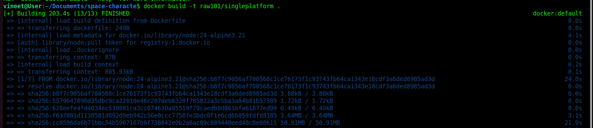
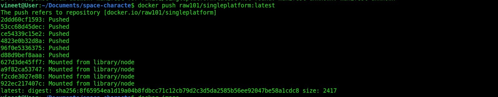
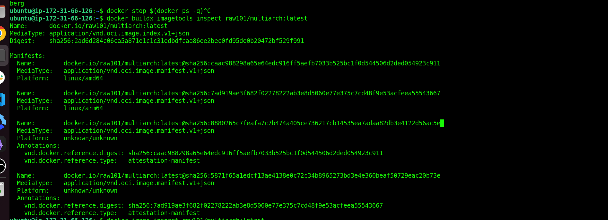
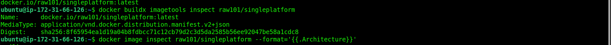
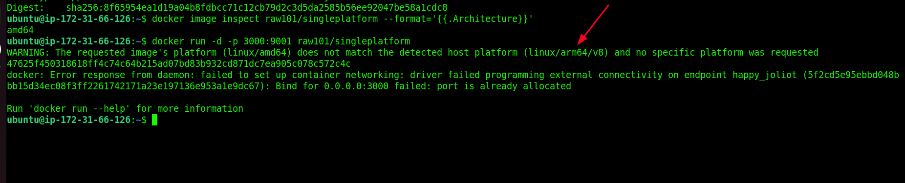
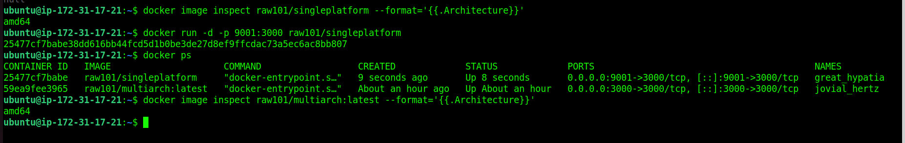
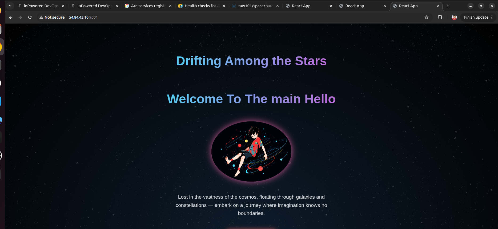

# Create multi-platiform docker image 

## Follow this article 
[Link](https://docs.docker.com/build/building/multi-platform/#difference-between-single-platform-and-multi-platform-images)

## requirment 
* **docker** 
* **QEMU**

### Install QEMU manually
If you're using a builder outside of Docker Desktop, such as if you're using Docker Engine on Linux, or a custom remote builder, you need to install QEMU and register the executable types on the host OS. The prerequisites for installing QEMU are: 


### Follow Commands 
```bash
docker run --privileged --rm tonistiigi/binfmt --install all # only once 
docker buildx create --use --name mybuilder
docker buildx inspect --bootstrap
docker buildx build \
  --platform linux/amd64,linux/arm64 \
  -t raw101/multiarch:latest \                                                      
  --push .
docker buildx imagetools inspect raw101/multiarch:latest 
docker image inspect raw101/singleplatform --format='{{.Architecture}}'

```

```bash
vineet@User:~/Documents/space-characte$ docker run --privileged --rm tonistiigi/binfmt --install all                                                         [290/330]
Unable to find image 'tonistiigi/binfmt:latest' locally                                                                                                               
latest: Pulling from tonistiigi/binfmt                                                                                                                                
f4700b809f99: Pull complete                                                                                                                                           
2adec5d296ac: Pull complete                                                                                                                                           
Digest: sha256:30cc9a4d03765acac9be2ed0afc23af1ad018aed2c28ea4be8c2eb9afe03fbd1                                                                                       
Status: Downloaded newer image for tonistiigi/binfmt:latest                                                                                                           
installing: arm OK                                                                                                                                                    
installing: mips64le OK                                                                                                                                               
installing: mips64 OK                                                                                                                                                 
installing: loong64 OK                                                                                                                                                
installing: arm64 OK                                                                                                                                                  
installing: s390x OK                                                                                                                                                  
installing: ppc64le OK                                                                                                                                                
installing: riscv64 OK                                                                                                                                                
{                                                                                                                                                                     
  "supported": [                                                                                                                                                      
    "linux/amd64",                                                                                                                                                    
    "linux/amd64/v2",                                                                                                                                                 
    "linux/amd64/v3",                                                                                                                                                 
    "linux/arm64",                                                                                                                                                    
    "linux/riscv64",                                                                                                                                                  
    "linux/ppc64le",                                                                                                                                                  
    "linux/s390x",                                                                                                                                                    
    "linux/386",                                                                                                                                                      
    "linux/mips64le",                                                                                                                                                 
    "linux/mips64",                                                                                                                                                   
    "linux/loong64",                                                                                                                                                  
    "linux/arm/v7",                                                                                                                                                   
    "linux/arm/v6"                                                                                                                                                    
  ],                                                                                                                                                                  
  "emulators": [                                                                                                                                                      
    "python3.10",                                                                                                                                                     
    "qemu-aarch64",                                                                                                                                                   
    "qemu-arm",                                                                                                                                                       
    "qemu-loongarch64",
    "qemu-mips64",
    "qemu-mips64el",
    "qemu-ppc64le",
    "qemu-riscv64",
    "qemu-s390x"
  ]
}

```

```bash
vineet@User:~/Documents/space-characte$ docker buildx create --use --name mybuilder 
docker buildx inspect --bootstrap
mybuilder
[+] Building 3.7s (1/1) FINISHED         
 => [internal] booting buildkit                                                                                                                                  3.7s
 => => pulling image moby/buildkit:buildx-stable-1                                                                                                               3.1s
 => => creating container buildx_buildkit_mybuilder0                                                                                                             0.6s
Name:          mybuilder
Driver:        docker-container
Last Activity: 2025-12-04 18:48:35 +0000 UTC

Nodes:
Name:                  mybuilder0
Endpoint:              unix:///var/run/docker.sock
Status:                running
BuildKit daemon flags: --allow-insecure-entitlement=network.host
BuildKit version:      v0.26.2
Platforms:             linux/amd64, linux/amd64/v2, linux/amd64/v3, linux/arm64, linux/riscv64, linux/ppc64le, linux/s390x, linux/386, linux/mips64le, linux/mips64, l
inux/loong64, linux/arm/v7, linux/arm/v6
Labels:
 org.mobyproject.buildkit.worker.executor:         oci
 org.mobyproject.buildkit.worker.hostname:         58a984016c63
 org.mobyproject.buildkit.worker.network:          host
 org.mobyproject.buildkit.worker.oci.process-mode: sandbox
 org.mobyproject.buildkit.worker.selinux.enabled:  false
 org.mobyproject.buildkit.worker.snapshotter:      overlayfs
GC Policy rule#0:
 All:            false
 Filters:        type==source.local,type==exec.cachemount,type==source.git.checkout 
 Keep Duration:  48h0m0s
 Max Used Space: 488.3MiB
GC Policy rule#1:
 All:            false
 Keep Duration:  1440h0m0s
 Reserved Space: 9.313GiB
 Max Used Space: 93.13GiB
 Min Free Space: 43.77GiB
GC Policy rule#2:
 All:            false
 Reserved Space: 9.313GiB
 Max Used Space: 93.13GiB
  Min Free Space: 43.77GiB
GC Policy rule#3:
 All:            true
 Reserved Space: 9.313GiB
 Max Used Space: 93.13GiB
 Min Free Space: 43.77G

```

```bash
vineet@User:~/Documents/space-characte$ docker buildx build \                                                                                                 [17/330]
  --platform linux/amd64,linux/arm64 \
  -t raw101/multiarch:latest \                                                      
  --push .
[+] Building 609.9s (22/22) FINISHED                                                                                                       docker-container:mybuilder
 => [internal] load build definition from Dockerfile                                                                                                             0.0s
 => => transferring dockerfile: 249B                                                                                                                             0.0s
 => [linux/amd64 internal] load metadata for docker.io/library/node:24-alpine3.21                                                                                4.2s
 => [linux/arm64 internal] load metadata for docker.io/library/node:24-alpine3.21                                                                                4.2s
 => [auth] library/node:pull token for registry-1.docker.io                                                                                                      0.0s
 => [internal] load .dockerignore                                                                                                                                0.0s
 => => transferring context: 87B                                                                                                                                 0.0s
 => [internal] load build context                                                                                                                                0.4s
 => => transferring context: 10.76MB                                                                                                                             0.3s
 => [linux/amd64 1/7] FROM docker.io/library/node:24-alpine3.21@sha256:b8f7c9056af700568c1ce76173f1c93743fb64ca1343e18cdf3a6ded8985ad3d                         23.1s
 => => resolve docker.io/library/node:24-alpine3.21@sha256:b8f7c9056af700568c1ce76173f1c93743fb64ca1343e18cdf3a6ded8985ad3d                                      0.0s
 => => sha256:2e4f6905394d18527dcfcf7497e9caa612d29781a41069a05191a12a6ac03974 445B / 445B                                                                       0.7s
 => => sha256:ca07fb1747d3d7bb9a8e9975cbc602074f76832e8265474b42fdf1a2bcda7970 1.26MB / 1.26MB                                                                   1.0s
 => => sha256:cc0596da6b71bbc54b5907107b6f738642e0b2a6ac09c089440eed40c8e08611 50.91MB / 50.91MB                                                                21.2s
 => => sha256:f637881d1138581d892d9eb942c56e0ccc7758fe3bdc0f1e6cd66059fdfd8185 3.64MB / 3.64MB                                                                   2.5s
 => => extracting sha256:f637881d1138581d892d9eb942c56e0ccc7758fe3bdc0f1e6cd66059fdfd8185                                                                        0.2s
 => => extracting sha256:cc0596da6b71bbc54b5907107b6f738642e0b2a6ac09c089440eed40c8e08611                                                                        1.6s
 => => extracting sha256:ca07fb1747d3d7bb9a8e9975cbc602074f76832e8265474b42fdf1a2bcda7970                                                                        0.0s
 => => extracting sha256:2e4f6905394d18527dcfcf7497e9caa612d29781a41069a05191a12a6ac03974                                                                        0.0s
 => [linux/arm64 1/7] FROM docker.io/library/node:24-alpine3.21@sha256:b8f7c9056af700568c1ce76173f1c93743fb64ca1343e18cdf3a6ded8985ad3d                         63.2s
 => => resolve docker.io/library/node:24-alpine3.21@sha256:b8f7c9056af700568c1ce76173f1c93743fb64ca1343e18cdf3a6ded8985ad3d                                      0.1s
 => => sha256:2e78e155d183f203df8fe75816fad2fe4ab8c9eb301ebea7e66e6aede1718bf8 444B / 444B                                                                       1.1s
 => => sha256:f51607871f4af157a4880f9bfbdbd4d93ccb2312932994b2bca79489de5377fc 1.26MB / 1.26MB                                                                   8.0s
 => => sha256:b74bb22f3153159c75280944db6a76fb4e5c100134049b8c8497b2c69737fe2a 50.80MB / 50.80MB                                                                58.2s
 => => sha256:c2fe130f4aabc917e559e7eed7d37b0e21ba13b44520101696887ca892e8c63f 3.99MB / 3.99MB                                                                   4.6s
 => => extracting sha256:c2fe130f4aabc917e559e7eed7d37b0e21ba13b44520101696887ca892e8c63f                                                                        0.2s
 => => extracting sha256:b74bb22f3153159c75280944db6a76fb4e5c100134049b8c8497b2c69737fe2a                                                                        2.5s
 => => extracting sha256:f51607871f4af157a4880f9bfbdbd4d93ccb2312932994b2bca79489de5377fc                                                                        0.1s
 => => extracting sha256:2e78e155d183f203df8fe75816fad2fe4ab8c9eb301ebea7e66e6aede1718bf8                                                                        0.0s
 => [linux/amd64 2/7] RUN addgroup app &&     adduser -D -G app app                                                                                              0.9s
 => [linux/amd64 3/7] WORKDIR /app                                                                                                                               0.1s
 => [linux/amd64 4/7] COPY package*.json .                                                                                                                       0.1s 
 => [linux/amd64 5/7] RUN npm install                                                                                                                           36.5s 
 => [linux/amd64 6/7] COPY . .                                                                                                                                   2.1s 
 => [linux/amd64 7/7] RUN chown -R app:app /app                                                                                                                 98.8s 
 => [linux/arm64 2/7] RUN addgroup app &&     adduser -D -G app app                                                                                              0.6s 
 => [linux/arm64 3/7] WORKDIR /app 
 => [linux/arm64 4/7] COPY package*.json .                                                                                                                       0.1s
 => [linux/arm64 5/7] RUN npm install                                                                                                                          239.8s
 => [linux/arm64 6/7] COPY . .                                                                                                                                   0.8s 
 => [linux/arm64 7/7] RUN chown -R app:app /app                                                                                                                114.5s
 => exporting to image                                                                                                                                         186.3s
 => => exporting layers                                                                                                                                         42.5s
 => => exporting manifest sha256:caac988298a65e64edc916ff5aefb7033b525bc1f0d544506d2ded054923c911                                                                0.0s
 => => exporting config sha256:b08ac880d080412db2d2a622f1547da2718fa9d22bbacaed995b67fbe9281bd2                                                                  0.0s
 => => exporting attestation manifest sha256:8880265c7feafa7c7b474a405ce736217cb14535ea7adaa82db3e4122d56ac5e                                                    0.1s
 => => exporting manifest sha256:7ad919ae3f682f02278222ab3e8d5060e77e375c7cd48f9e53acfeea55543667                                                                0.0s
 => => exporting config sha256:8881f425a47c93b172aa2ccfdadc91b98c4567bf65af9fb436954563bda17f7f                                                                  0.0s
 => => exporting attestation manifest sha256:5871f65a1edcf13ae4138e0c72c34b8965273bd3e4e360beaf50729eac20b73e                                                    0.1s
 => => exporting manifest list sha256:2ad6d284c06ca5a871e1c1c31edbdfcaa86ee2bec0fd95de0b20472bf529f991                                                           0.0s
 => => pushing layers                                                                                                                                          136.8s
 => => pushing manifest for docker.io/raw101/multiarch:latest@sha256:2ad6d284c06ca5a871e1c1c31edbdfcaa86ee2bec0fd95de0b20472bf529f991                            6.6s
 => [auth] raw101/multiarch:pull,push token for registry-1.docker.io  
 ```                 

### Build single platform image and push dockerhub
**build**

**push**



### How to Check Image multiplaform
```bash
```




### Try run single platform image to the amd or arm platform 
**ARM**


**AMD**

**itworking**
