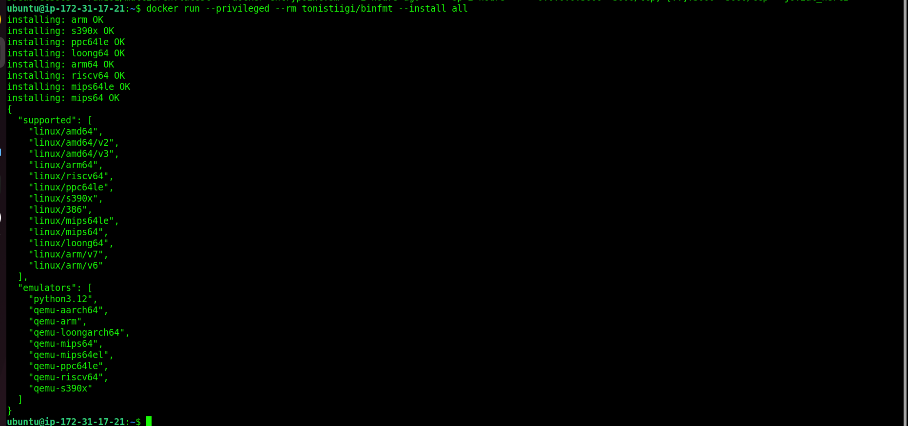
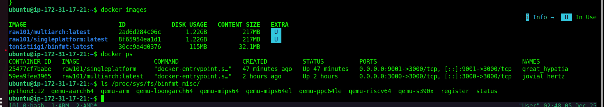

# Create multi-platiform docker image 

## Follow this article 
[Link](https://docs.docker.com/build/building/multi-platform/#difference-between-single-platform-and-multi-platform-images)

## requirment 
* **docker** 
* **QEMU**

### Install QEMU manually
If you're using a builder outside of Docker Desktop, such as if you're using Docker Engine on Linux, or a custom remote builder, you need to install QEMU and register the executable types on the host OS. The prerequisites for installing QEMU are: 

```bash
docker run --privileged --rm tonistiigi/binfmt --install all
```


```bash
ls /proc/sys/fs/binfmt_misc/
```



### [setup jenkins](https://www.jenkins.io/doc/book/installing/linux/) 

### [use this script](./jenkins.sh)

